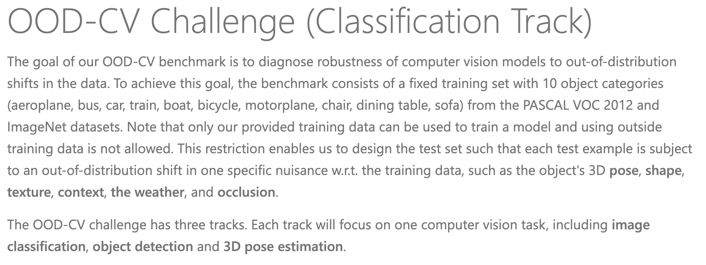
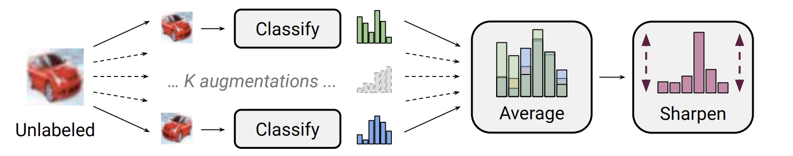

# Dataset


## Requirment
``` shell
pip install -r requirements.txt
```

## Dataset


## Result
| Backbone                 | MixMatch                 |
|--------------------------|--------------------------|
|  |  |

## Reference

- YU1ut [MixMatch-pytorch](https://github.com/YU1ut/MixMatch-pytorch)  
- Jeffkang-94 [Mixmatch-pytorch-SSL](https://github.com/Jeffkang-94/Mixmatch-pytorch-SSL/tree/master)  
- google-research [mixmatch](https://github.com/google-research/mixmatch)  

```
@article{berthelot2019mixmatch,
  title={MixMatch: A Holistic Approach to Semi-Supervised Learning},
  author={Berthelot, David and Carlini, Nicholas and Goodfellow, Ian and Papernot, Nicolas and Oliver, Avital and Raffel, Colin},
  journal={arXiv preprint arXiv:1905.02249},
  year={2019}
}
```


